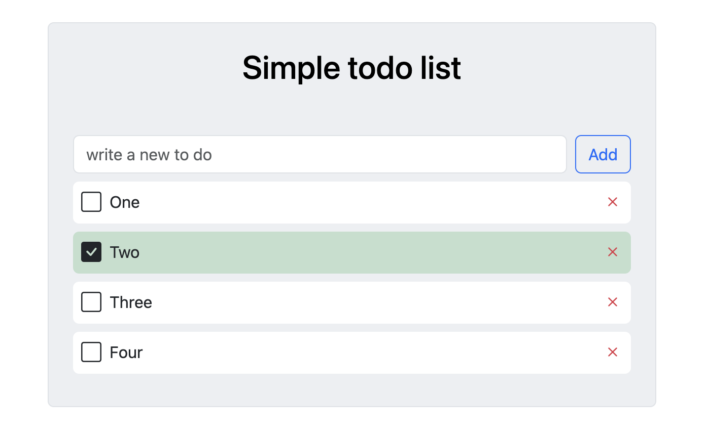

# Simple Todo List app 

---

This time on my learning code projec I'm doing a small todo list app using React + boostrap + local storage. 

It was my first time doing an ux with event listener in react and my first time using bootstrap. 

[view app](https://roberirini-todolist-bootstrap.netlify.app/)

---

[thanks for  this tutorial](https://www.youtube.com/watch?v=y97U9Ikd7TI)